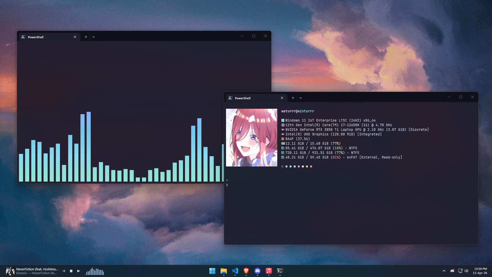

# windows-dots

These are my dotfiles for Windows, focused on PowerShell and related tooling.

For Linux dots, see the Loonix branch in this repo: https://github.com/GaseousIce/dotfiles/tree/loonix



## Hardlink PowerShell profile

Create a hardlink from your profile location to this repo so PowerShell picks up the shared profile. Run these from the repo root so relative paths work.

PowerShell:

```powershell
New-Item -ItemType Directory -Path "$env:USERPROFILE\Documents\PowerShell" -Force
New-Item -ItemType HardLink -Path "$env:USERPROFILE\Documents\PowerShell\Microsoft.PowerShell_profile.ps1" -Target "$PWD\powershell\Microsoft.PowerShell_profile.ps1"
```

Command Prompt:

```cmd
mkdir "%USERPROFILE%\Documents\PowerShell"
mklink /H "%USERPROFILE%\Documents\PowerShell\Microsoft.PowerShell_profile.ps1" "%CD%\powershell\Microsoft.PowerShell_profile.ps1"
```

## Hardlink Windows Terminal settings

Create a hardlink from Windows Terminal's settings file to this repo. Run these from the repo root so relative paths work.

If you use Windows Terminal Preview, replace `Microsoft.WindowsTerminal_8wekyb3d8bbwe` with `Microsoft.WindowsTerminalPreview_8wekyb3d8bbwe` in the paths below.

PowerShell:

```powershell
New-Item -ItemType Directory -Path "$env:LOCALAPPDATA\Packages\Microsoft.WindowsTerminal_8wekyb3d8bbwe\LocalState" -Force
New-Item -ItemType HardLink -Path "$env:LOCALAPPDATA\Packages\Microsoft.WindowsTerminal_8wekyb3d8bbwe\LocalState\settings.json" -Target "$PWD\windows-terminal\settings.json"
```

Command Prompt:

```cmd
mkdir "%LOCALAPPDATA%\Packages\Microsoft.WindowsTerminal_8wekyb3d8bbwe\LocalState"
mklink /H "%LOCALAPPDATA%\Packages\Microsoft.WindowsTerminal_8wekyb3d8bbwe\LocalState\settings.json" "%CD%\windows-terminal\settings.json"
```

## FluentFlyout Settings

To import the FluentFlyout configuration, open [FluentFlyout](https://github.com/unchihugo/fluentflyout/), go to the **System** tab, navigate to the **Backup and Restore** section, and click **Import Settings**. Then select the `FluentFlyout/settings.xml` file from this repo.

## Winhance Config

My Winhance config is in `winhance/config.winhance`.

To install my config, open [Winhance](https://github.com/memstechtips/Winhance), go to the **Settings** tab, then in the **Configuration** section click **Import** and select `winhance/config.winhance` from this repo.

> [!WARNING]
> This is my personal config. It may break on some systems, and a lot of it is preference-based, so you might not enjoy how it behaves.
> Use it at your own risk.

If you want to test it, back up your current config first so you can revert, or create a restore point before making changes.

## StartAllBack

I use [StartAllBack](https://www.startallback.com/) to reduce bright flashes in legacy apps and older pages.

It is mostly a preference thing. It is lightweight, and if you like legacy Windows UI elements, it can bring some of that look back.

I mainly use it for a more consistent dark-mode experience on Windows, but it is not flawless, and some legacy pages can still flash bright.

## Wallpapers

The wallpapers in the `wallpapers/` folder are sourced primarily from [Wallhaven](https://wallhaven.cc) and various other sources. I don't retain detailed attribution for all of them, so please don't sue me. If you see your work here and want attribution or removal, feel free to reach out.
